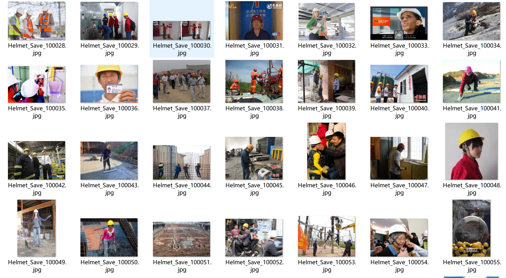
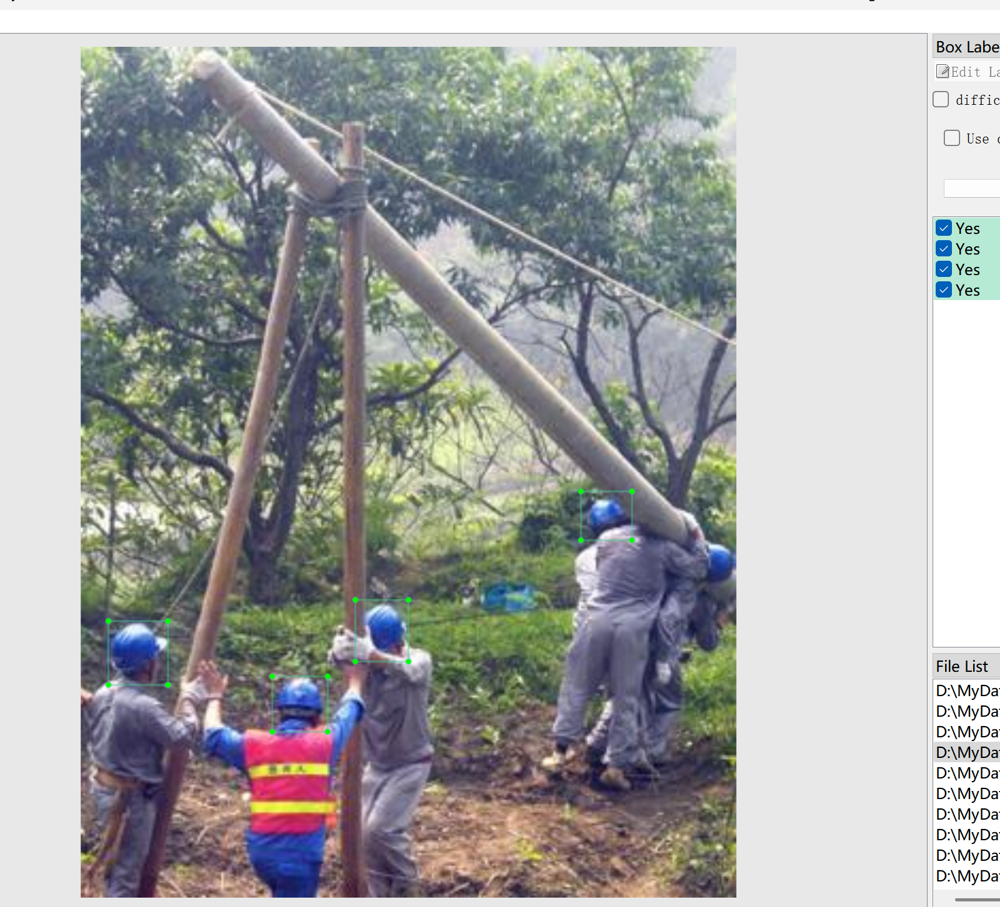
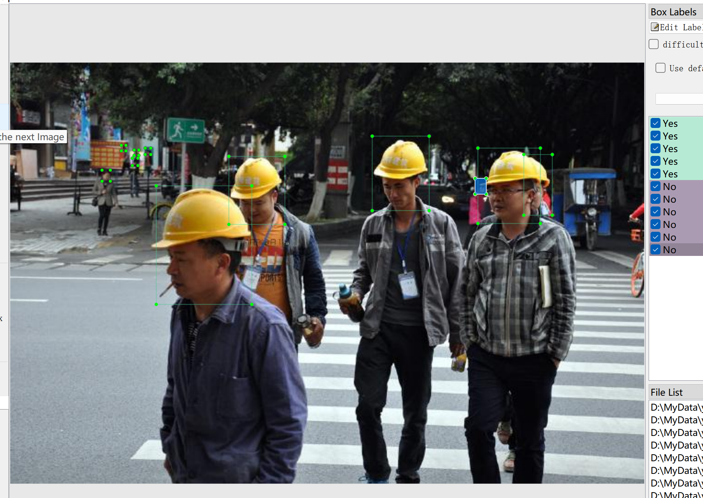

# Safety Equipment Helmet Detection - Target Detection Dataset

Dataset Information: The dataset consists of 7438 images and corresponding labeled files. There are two formats for the labeled files, including VOC formatted xml files and YOLO formatted txt files.

No: 109559 Unhelmeted (Human Head)
Yes: 8710 Helmets
['No', 'Yes']
The number of images and number of bounding box labels are as follows: (The labeling is usually in English, but Chinese subtitles are provided in parentheses for reference.)
Note: An image may be labeled multiple times, so the total number of bounding boxes might be greater than the number of images.

The complete dataset includes three folders and one txt file:
- all_txt folder and classes.txt: Stores the YOLO formatted txt labeled files, with the number of labeled files equal to the number of images. Each labeled file is one-to-one corresponding.
- classes.txt:
- all_xml folder: VOC formatted xml labeled files. The number of labeled files is the same as the number of images, each labeled file is one-to-one corresponding.
How to read the standard file of VOC format can be found by yourself by searching Baidu.
Both formats are available, choose one of them.

Labeling effect screenshot:

## Images

Here is a pay link on Stripe ( https://buy.stripe.com/3cs8yP7sY87d0vu9AB ). Please contact me lonlonago@foxmail.com after funding $89, and I will send you a complete data files , thank you!

